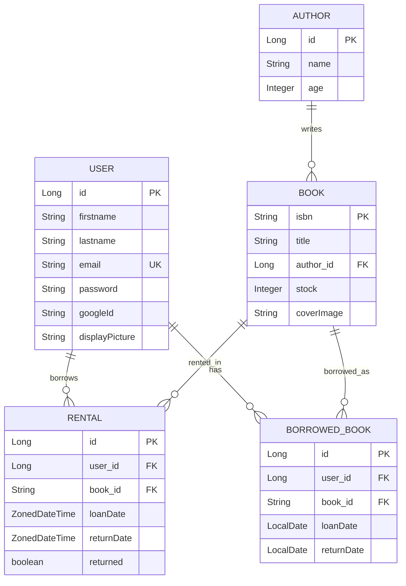

## Overview

The Library API uses JPA entities to model the core domain concepts: books, authors, users, and rental transactions. These entities are mapped to database tables with relationships defined using JPA annotations.

## Entity Relationships



## Author Entity

Defined in `AuthorEntity.java:19-29`, represents book authors:

```java
@Entity
@Table(name = "authors")
public class AuthorEntity {

    @Id
    @GeneratedValue(strategy = GenerationType.SEQUENCE, generator = "author_id_sequence")
    private Long id;

    private String name;

    private Integer age;
}
```

### Fields

<ParamField path="id" type="Long" required>
  Auto-generated sequence ID serving as the primary key
</ParamField>

<ParamField path="name" type="String">
  Author's full name
</ParamField>

<ParamField path="age" type="Integer">
  Author's age
</ParamField>

## Book Entity

Defined in `BookEntity.java:24-43`, represents books in the library:

```java
@Entity
@Table(name = "books")
public class BookEntity {

    @Id
    private String isbn;

    private String title;

    @ManyToOne(cascade = CascadeType.ALL)
    @JoinColumn(name = "author_id")
    private AuthorEntity author;

    @OneToMany(mappedBy = "book", orphanRemoval = true)
    private Set<RentalEntity> rentals;

    private Integer stock;

    @Column(nullable = true)
    private String coverImage;
}
```

### Fields

<ParamField path="isbn" type="String" required>
  International Standard Book Number, serving as the primary key
</ParamField>

<ParamField path="title" type="String">
  Book title
</ParamField>

<ParamField path="author" type="AuthorEntity">
  Many-to-one relationship with Author. Cascade operations are enabled, so saving a book can create/update its author
</ParamField>

<ParamField path="rentals" type="Set<RentalEntity>">
  One-to-many relationship with Rental records. Uses `orphanRemoval = true` to automatically delete rental records when removed from this collection
</ParamField>

<ParamField path="stock" type="Integer">
  Number of available copies. Decremented when books are rented and incremented when returned
</ParamField>

<ParamField path="coverImage" type="String">
  URL or path to the book's cover image (optional)
</ParamField>

### Cascade Behavior

<Info>
The `@ManyToOne(cascade = CascadeType.ALL)` on the author relationship means that when you save or update a book, the associated author will also be persisted automatically.
</Info>

## User Entity

Defined in `UserEntity.java:23-48`, represents registered users:

```java
@Entity
@Table(name = "users")
public class UserEntity {

    @Id
    @GeneratedValue(strategy = GenerationType.SEQUENCE, generator = "user_id_sequence")
    private Long id;

    private String firstname;

    private String lastname;

    @Column(unique = true, nullable = false)
    private String email;

    @OneToMany(mappedBy = "user")
    private Set<RentalEntity> borrowedBooks;

    @Column(nullable = true)
    private String password;

    @Column(nullable = true)
    private String googleId;

    @Column(nullable = true)
    private String displayPicture;
}
```

### Fields

<ParamField path="id" type="Long" required>
  Auto-generated sequence ID serving as the primary key
</ParamField>

<ParamField path="firstname" type="String">
  User's first name
</ParamField>

<ParamField path="lastname" type="String">
  User's last name
</ParamField>

<ParamField path="email" type="String" required>
  Unique email address used as the username for authentication. Marked as `unique = true` and `nullable = false`
</ParamField>

<ParamField path="borrowedBooks" type="Set<RentalEntity>">
  One-to-many relationship with Rental records tracking all books this user has borrowed
</ParamField>

<ParamField path="password" type="String">
  BCrypt-hashed password for local authentication (optional if using OAuth)
</ParamField>

<ParamField path="googleId" type="String">
  Google OAuth identifier for social authentication (optional)
</ParamField>

<ParamField path="displayPicture" type="String">
  URL to user's profile picture (optional)
</ParamField>

<Note>
The email field is the unique identifier for authentication. The `UserPrincipal.java:24-26` implementation uses email as the username.
</Note>

## Rental Entity

Defined in `RentalEntity.java:23-43`, tracks book loans:

```java
@Entity
@Table(name = "rentals")
public class RentalEntity {

    @Id
    @GeneratedValue(strategy = GenerationType.SEQUENCE, generator = "rental_id_sequence")
    private Long id;

    @ManyToOne
    @JoinColumn(name = "user_id")
    private UserEntity user;

    @ManyToOne
    @JoinColumn(name = "book_id")
    private BookEntity book;

    private ZonedDateTime loanDate;

    private ZonedDateTime returnDate;

    private boolean returned;
}
```

### Fields

<ParamField path="id" type="Long" required>
  Auto-generated sequence ID serving as the primary key
</ParamField>

<ParamField path="user" type="UserEntity">
  Many-to-one relationship identifying who borrowed the book
</ParamField>

<ParamField path="book" type="BookEntity">
  Many-to-one relationship identifying which book was borrowed
</ParamField>

<ParamField path="loanDate" type="ZonedDateTime">
  Timestamp when the book was borrowed (stored in UTC as seen in `RentalController.java:78`)
</ParamField>

<ParamField path="returnDate" type="ZonedDateTime">
  Expected or actual return date. Set to 2 weeks after loan date by default (`RentalController.java:80`)
</ParamField>

<ParamField path="returned" type="boolean">
  Flag indicating whether the book has been returned. Updated by the return endpoint in `RentalController.java:94`
</ParamField>

### Rental Logic

When a book is rented (`RentalController.java:59-85`):
1. Validates that both book and user exist
2. Checks book stock availability
3. Decrements book stock by 1
4. Creates rental record with loan date and return date (2 weeks)
5. Returns HTTP 201 (CREATED) with the rental details

When a book is returned (`RentalController.java:88-106`):
1. Marks the rental as returned
2. Increments book stock by 1
3. Returns HTTP 200 (OK) with updated rental details

## Borrowed Book Entity

Defined in `BorrowedBookEntity.java:23-40`, provides an alternative representation of borrowed books:

```java
@Entity
@Table(name = "borrowed_books")
public class BorrowedBookEntity {

    @Id
    @GeneratedValue(strategy = GenerationType.IDENTITY)
    private Long id;

    @ManyToOne
    @JoinColumn(name = "user_id")
    private UserEntity user;

    @ManyToOne
    @JoinColumn(name = "book_id")
    private BookEntity book;

    private LocalDate loanDate;

    private LocalDate returnDate;
}
```

### Fields

<ParamField path="id" type="Long" required>
  Auto-generated identity ID serving as the primary key
</ParamField>

<ParamField path="user" type="UserEntity">
  Many-to-one relationship identifying who borrowed the book
</ParamField>

<ParamField path="book" type="BookEntity">
  Many-to-one relationship identifying which book was borrowed
</ParamField>

<ParamField path="loanDate" type="LocalDate">
  Date when the book was borrowed (date only, no time component)
</ParamField>

<ParamField path="returnDate" type="LocalDate">
  Expected or actual return date (date only, no time component)
</ParamField>

<Note>
This entity differs from `RentalEntity` by using `LocalDate` instead of `ZonedDateTime` and `GenerationType.IDENTITY` instead of `SEQUENCE`. The choice between these entities depends on whether you need timezone information and which ID generation strategy is preferred.
</Note>

## Key Design Patterns

### Lombok Annotations

All entities use Lombok annotations for boilerplate reduction:

- `@Data` - Generates getters, setters, toString, equals, and hashCode
- `@AllArgsConstructor` - Generates constructor with all fields
- `@NoArgsConstructor` - Generates no-argument constructor (required by JPA)
- `@Builder` - Implements builder pattern for object construction

### Primary Key Strategies

<CardGroup cols={2}>
  <Card title="Sequence Generation" icon="arrow-up-1-9">
    Used by Author, User, and Rental entities. Generates IDs using database sequences for better performance with batch inserts.
  </Card>
  <Card title="Natural Key" icon="key">
    Book entity uses ISBN as a natural primary key since ISBNs are unique and meaningful identifiers.
  </Card>
  <Card title="Identity Generation" icon="fingerprint">
    BorrowedBook entity uses database identity columns for auto-incrementing IDs.
  </Card>
</CardGroup>

### Bidirectional Relationships

Several bidirectional relationships exist in the model:

- **Book ↔ Rental**: Book has `Set<RentalEntity> rentals`, Rental has `BookEntity book`
- **User ↔ Rental**: User has `Set<RentalEntity> borrowedBooks`, Rental has `UserEntity user`

<Warning>
When working with bidirectional relationships, maintain both sides of the relationship to avoid data inconsistencies. The `mappedBy` attribute indicates which side owns the relationship.
</Warning>
